# Como configurar/instalar o `Microsoft Office 2016` no `Linux Ubuntu`

## Resumo

Neste documento estão contidos os principais comandos e configurações para instalar/configurar o `Microsoft Office 2016` no `Linux Ubuntu`.

## _Abstract_

_This document contains the main commands and settings to install/configure the `Microsoft Office 2016` on `Linux Ubuntu`._


## Descrição [2]

### `Microsoft Office 2016`

O `Microsoft Office 2016` é uma suíte de aplicativos de produtividade lançada pela `Microsoft`, que oferece ferramentas essenciais tanto para usuários domésticos quanto para empresas. Inclui programas populares como `Word`, `Excel`, `PowerPoint`, `Outlook`, `Access` e `Publisher`, cada um com funções específicas que vão desde a criação de documentos de texto e gerenciamento de e-mails, até análise de dados e apresentações dinâmicas. O `Office 2016` trouxe melhorias significativas em colaboração e segurança, integrando-se com o `OneDrive` e outros serviços em nuvem, e apresentando recursos como a coautoria em tempo real e a proteção de dados avançada, refletindo as necessidades de um ambiente de trabalho mais conectado e seguro.


## 1. Como baixar o arquivo `.iso` do `Microsoft Office 2016`

1. Acessar o website <https://massgrave.dev/>

<div align="center">
    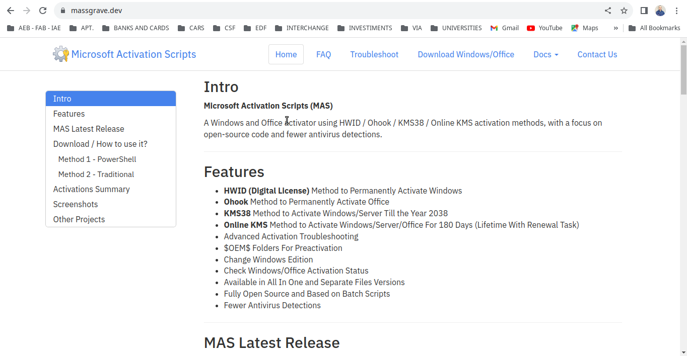
    <p>Fig. 1 . https://massgrave.dev. </p>
</div>

2. Clicar em `Download Windows/Office`

<div align="center">
    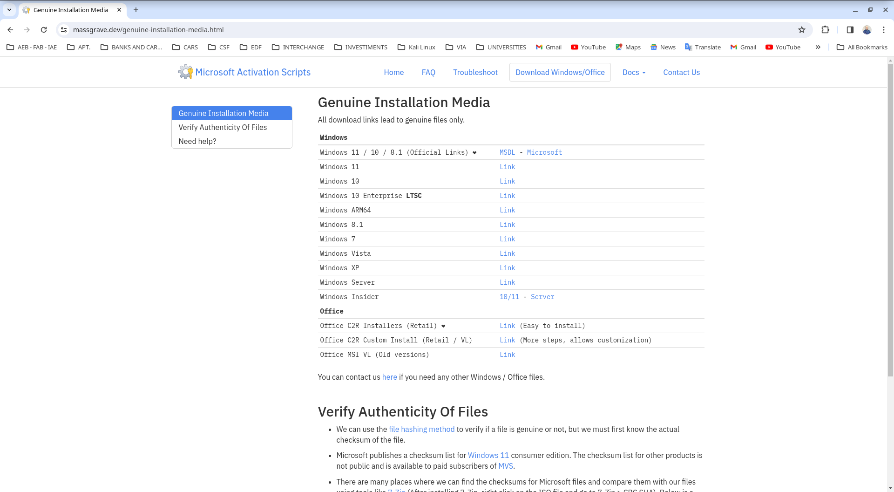
    <p>Fig. 2 https://massgrave.dev/#Download__How_to_use_it.</p>
</div>


3. Clicar em `Office MSI VL (Old versions)`

<div align="center">
    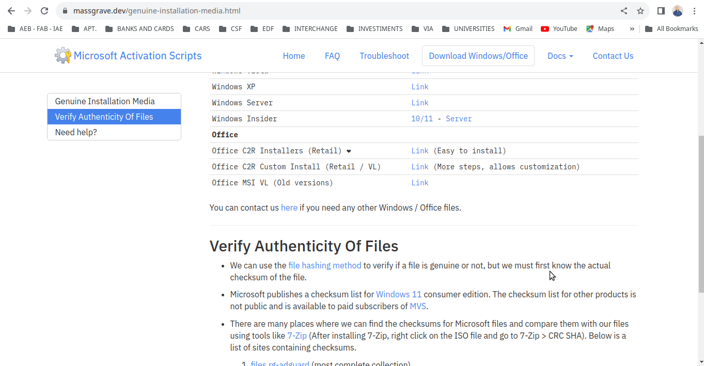
    <p>Fig. 3 https://massgrave.dev/genuine-installation-media.html#Verify_Authenticity_Of_Files.</p>
</div>


4. Clicar em `Office MSI VL Download`

<div align="center">
    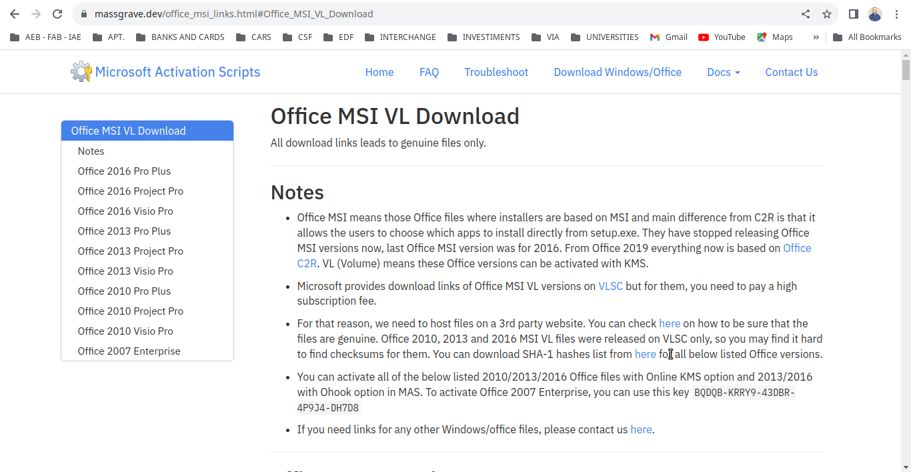
    <p>Fig. 4 .</p>
</div>


5. Clicar me `Office 2016 Pro Plus`

<div align="center">
    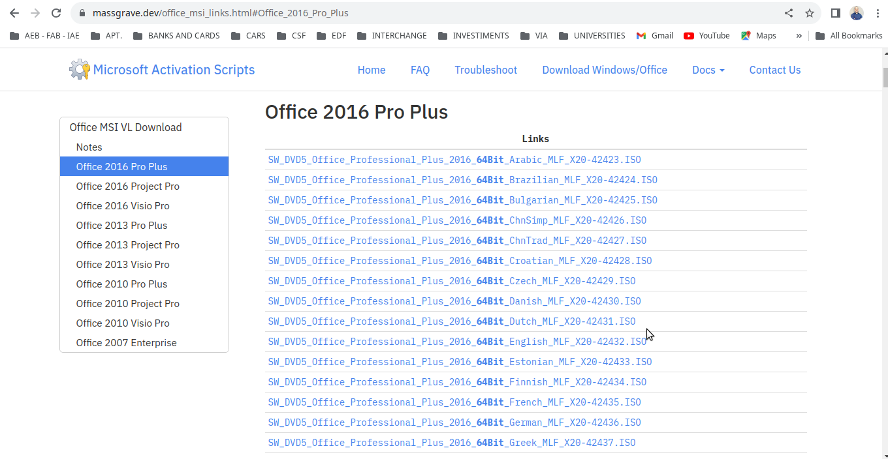
    <p>Fig. 5 .</p>
</div>


6. Clicar me `SW_DVD5_Office_Professional_Plus_2016_W32_English_MLF_X20-41353.ISO`

<div align="center">
    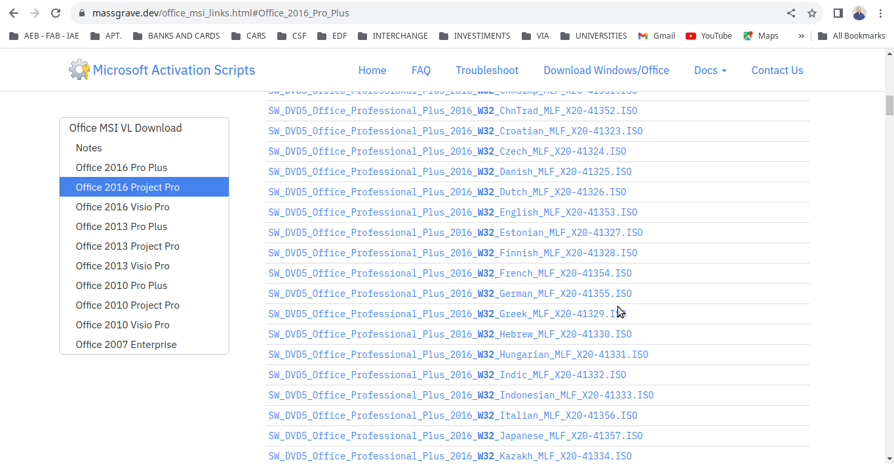
    <p>Fig. 6 .</p>
</div>

7. Salvar o arquivo em um pasta.

## 2. Como converter o arquivo `.iso` do `Microsoft Office 2016` em `.img` no `Linux Ubuntu` [4]

Para converter um arquivo `.iso` para `.img` no `Terminal Emulator` do `Linux Ubuntu`, você pode usar a ferramenta `dd`, que é um utilitário de linha de comando para converter e copiar arquivos. Aqui está um exemplo de como fazer isso:

1. Abra o `Terminal Emulator`. Você pode fazer isso pressionando: `Ctrl + Alt + T`


2. Certifique-se de que seu sistema esteja limpo e atualizado.

    2.1 Limpar o `cache` do gerenciador de pacotes `apt`. Especificamente, ele remove todos os arquivos de pacotes (`.deb`) baixados pelo `apt` e armazenados em `/var/cache/apt/archives/`. Digite o seguinte comando: `sudo apt clean` 
    
    2.2 Remover pacotes `.deb` antigos ou duplicados do cache local. É útil para liberar espaço, pois remove apenas os pacotes que não podem mais ser baixados (ou seja, versões antigas de pacotes que foram atualizados). Digite o seguinte comando: `sudo apt autoclean`

    2.3 Remover pacotes que foram automaticamente instalados para satisfazer as dependências de outros pacotes e que não são mais necessários. Digite o seguinte comando: `sudo apt autoremove -y`

    2.4 Buscar as atualizações disponíveis para os pacotes que estão instalados em seu sistema. Digite o seguinte comando e pressione `Enter`: `sudo apt update`

    2.5 **Corrigir pacotes quebrados**: Isso atualizará a lista de pacotes disponíveis e tentará corrigir pacotes quebrados ou com dependências ausentes: `sudo apt --fix-broken install`

    2.6 Limpar o `cache` do gerenciador de pacotes `apt`. Especificamente, ele remove todos os arquivos de pacotes (`.deb`) baixados pelo `apt` e armazenados em `/var/cache/apt/archives/`. Digite o seguinte comando: `sudo apt clean` 
    
    2.7 Para ver a lista de pacotes a serem atualizados, digite o seguinte comando e pressione `Enter`:  `sudo apt list --upgradable`

    2.8 Realmente atualizar os pacotes instalados para as suas versões mais recentes, com base na última vez que você executou `sudo apt update`. Digite o seguinte comando e pressione `Enter`: `sudo apt full-upgrade -y`
  

3. Use o comando `dd` com a seguinte sintaxe: `sudo dd if=/caminho/para/arquivo.iso of=/caminho/para/arquivo.img bs=4M`

    - `if=` especifica o arquivo de entrada (input file), que seria seu arquivo `.iso`.

    - `of=` especifica o arquivo de saída (output file), que será o novo arquivo `.img`.

    - `bs=4M` define o tamanho do bloco para 4 megabytes, o que pode ajudar a acelerar o processo de conversão.

4. Pressione `Enter` para executar o comando.

    Por exemplo, para converter um arquivo chamado `meu_disco.iso` localizado no diretório `Downloads` para um arquivo `meu_disco.img` no mesmo diretório, o comando seria: `sudo dd if=~/Downloads/meu_disco.iso of=~/Downloads/meu_disco.img bs=4M`

Lembre-se de que este processo pode levar algum tempo, dependendo do tamanho do arquivo `.iso`. Além disso, tenha cuidado ao usar o comando `dd`, pois ele é muito poderoso e pode sobrescrever dados importantes se usado incorretamente.


## 3. Configurar/Instalar/Atualizar o `wine` para a versão mais atualizada e estável

Para atualizar o `Wine` para a versão `8.0.2` no Ubuntu, você pode seguir os passos abaixo. Note que estes passos são gerais e a disponibilidade de uma versão específica como `8.0.2` depende do repositório do `Wine` e se essa versão é oferecida para a distribuição do Ubuntu que você está usando.

Aqui está um guia passo a passo:

1. Abra o `Terminal Emulator`. Você pode fazer isso pressionando: `Ctrl + Alt + T`


2. Certifique-se de que seu sistema esteja limpo e atualizado.

    2.1 Limpar o `cache` do gerenciador de pacotes `apt`. Especificamente, ele remove todos os arquivos de pacotes (`.deb`) baixados pelo `apt` e armazenados em `/var/cache/apt/archives/`. Digite o seguinte comando: `sudo apt clean` 
    
    2.2 Remover pacotes `.deb` antigos ou duplicados do cache local. É útil para liberar espaço, pois remove apenas os pacotes que não podem mais ser baixados (ou seja, versões antigas de pacotes que foram atualizados). Digite o seguinte comando: `sudo apt autoclean`

    2.3 Remover pacotes que foram automaticamente instalados para satisfazer as dependências de outros pacotes e que não são mais necessários. Digite o seguinte comando: `sudo apt autoremove -y`

    2.4 Buscar as atualizações disponíveis para os pacotes que estão instalados em seu sistema. Digite o seguinte comando e pressione `Enter`: `sudo apt update`

    2.5 **Corrigir pacotes quebrados**: Isso atualizará a lista de pacotes disponíveis e tentará corrigir pacotes quebrados ou com dependências ausentes: `sudo apt --fix-broken install`

    2.6 Limpar o `cache` do gerenciador de pacotes `apt`. Especificamente, ele remove todos os arquivos de pacotes (`.deb`) baixados pelo `apt` e armazenados em `/var/cache/apt/archives/`. Digite o seguinte comando: `sudo apt clean` 
    
    2.7 Para ver a lista de pacotes a serem atualizados, digite o seguinte comando e pressione `Enter`:  `sudo apt list --upgradable`

    2.8 Realmente atualizar os pacotes instalados para as suas versões mais recentes, com base na última vez que você executou `sudo apt update`. Digite o seguinte comando e pressione `Enter`: `sudo apt full-upgrade -y`
    

3. **Remova a versão atual do Wine (opcional):** Se você já tem o Wine instalado e quer garantir uma instalação limpa, você pode remover a versão atual antes de instalar uma nova: `sudo apt remove --purge wine wine64 wine32 wine-stable wine-staging -y`

4. Habilite a arquitetura `i386` (se ainda não estiver habilitada), pois muitos aplicativos do Windows requerem suporte para 32 bits: `sudo dpkg --add-architecture i386`

5. Adicione o repositório do `WineHQ`:

    ```
    wget -nc https://dl.winehq.org/wine-builds/winehq.key
    sudo apt-key add winehq.key
    sudo add-apt-repository 'deb https://dl.winehq.org/wine-builds/ubuntu/ focal main'
    ```

6. Atualize os pacotes: `sudo apt update`

7. Instale a versão desejada do Wine:

    7.1 Para a versão estável:
    
    ```
    sudo apt-get install wine-stable:i386 smbclient winbind
    wine --version
    smbclient -V
    winbindd -V
    ```

    Se você quiser especificamente a versão `8.0.2`, você pode precisar baixar o pacote `.deb` correspondente diretamente do site do WineHQ se ele estiver disponível para o `Ubuntu`.

8. Verifique a versão instalada do Wine: `wine --version`

    Caso haja dependências não satisfeitas durante a instalação, o `apt` irá notificá-lo e, geralmente, você pode resolvê-las com o comando: `sudo apt -f install`

Depois de instalar o Wine, você pode tentar novamente instalar o `Microsoft Office 2016` usando o `PlayOnLinux` a partir da Seção `5`. Se você encontrar problemas de compatibilidade, considere também verificar se há scripts atualizados no `PlayOnLinux` para a instalação do `Office 2016`.


## 4. Configurar/Instalar o `Playonlinux` no `Linux Ubuntu` [1]

Para instalar o `Playonlinux` no `Linux Ubuntu`, você pode seguir estas etapas:

1. Abra o `Terminal Emulator`. Você pode fazer isso pressionando: `Ctrl + Alt + T`
    

2. Certifique-se de que seu sistema esteja limpo e atualizado.

    2.1 Limpar o `cache` do gerenciador de pacotes `apt`. Especificamente, ele remove todos os arquivos de pacotes (`.deb`) baixados pelo `apt` e armazenados em `/var/cache/apt/archives/`. Digite o seguinte comando: `sudo apt clean` 
    
    2.2 Remover pacotes `.deb` antigos ou duplicados do cache local. É útil para liberar espaço, pois remove apenas os pacotes que não podem mais ser baixados (ou seja, versões antigas de pacotes que foram atualizados). Digite o seguinte comando: `sudo apt autoclean`

    2.3 Remover pacotes que foram automaticamente instalados para satisfazer as dependências de outros pacotes e que não são mais necessários. Digite o seguinte comando: `sudo apt autoremove -y`

    2.4 Buscar as atualizações disponíveis para os pacotes que estão instalados em seu sistema. Digite o seguinte comando e pressione `Enter`: `sudo apt update`

    2.5 **Corrigir pacotes quebrados**: Isso atualizará a lista de pacotes disponíveis e tentará corrigir pacotes quebrados ou com dependências ausentes: `sudo apt --fix-broken install`

    2.6 Limpar o `cache` do gerenciador de pacotes `apt`. Especificamente, ele remove todos os arquivos de pacotes (`.deb`) baixados pelo `apt` e armazenados em `/var/cache/apt/archives/`. Digite o seguinte comando: `sudo apt clean` 
    
    2.7 Para ver a lista de pacotes a serem atualizados, digite o seguinte comando e pressione `Enter`:  `sudo apt list --upgradable`

    2.8 Realmente atualizar os pacotes instalados para as suas versões mais recentes, com base na última vez que você executou `sudo apt update`. Digite o seguinte comando e pressione `Enter`: `sudo apt full-upgrade -y`
  

3. **Instalar `PlayOnLinux`:** Agora, instale o `PlayOnLinux` com o seguinte comando: `sudo apt install playonlinux -y`

Depois de instalado, você pode abrir o `PlayOnLinux` a partir do menu de aplicativos ou executando `playonlinux` no terminal.


## 5. Configurar o `PlayOnLinux (POL)` [5]

**A considerar :** Wine x86 versão `4.15` é mais estável que `3.4` (abaixo) ou 3.14 (postagem do GlasierXplor no POL Forum). Ou seja, ele não trava aleatoriamente. A ressalva é que haverá alguns problemas com as imagens, mas deverá funcionar bem 97% das vezes. O Wine `4.15` requer a instalação da atualização POL `4.3.4` dos repositórios oficiais do `PlayOnLinux (POL)`.

1. A versão `3.4` do Wine x86 foi usada para esta instalação, então verifique se ele está instalado iniciando o `PlayOnLinux (POL)` e selecionando `Tools-> Manage Wine Versions`. Janela Gerenciar versões do Wine com x86 versão 3.4 instalada

<div align="center">
    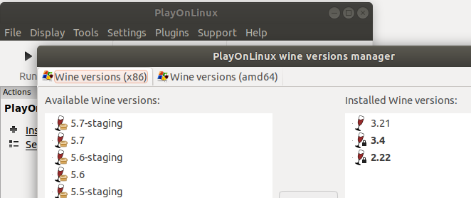
    <p>Fig. 14 .</p>
</div>

2. Se o Wine x86 versão `3.4` não aparecer em `Installed Wine versions`, selecione-a na janela `Available Wine versions:` e clique no botão `>` meio da janela para instalá-lo. Depois de instalado, feche e saia para o menu principal do `PlayOnLinux (POL)`.


3. No `PlayOnLinux (POL)`, selecione `Configure` para entrar na tela de configuração e clique `New` no canto inferior esquerdo para iniciar o criador do drive virtual.

4. Selecione instalação do Windows de 32 bits e pressione `Next`. Jogue no Linux 32 instalação do Windows de 32 bits

<div align="center">
    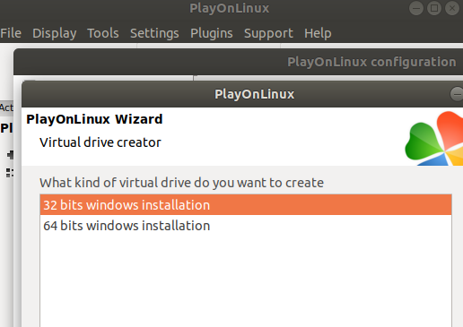
    <p>Fig. 15 .</p>
</div>


5. Selecione Wine versão `3.4` e pressione `Next`.

6. Dê um nome ao drive virtual (por exemplo `Office2016pp`) e pressione `Next` para iniciar a criação. Selecione para instalar o Mono se o POL solicitar.

7. Assim que a criação da unidade virtual for concluída, você deverá retornar à tela principal de configuração do `PlayOnLinux (POL)`. Certifique-se de que a unidade recém-criada (por exemplo `Office2016pp`) esteja selecionada na janela esquerda.

8. Clique na guia `Install components` na parte superior. Em seguida, role para baixo para selecionar `msxml6e` clique em `Install`.

<div align="center">
    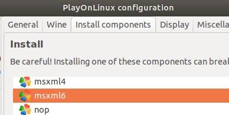
    <p>Fig. 16 .</p>
</div>

9. Repita a etapa acima para instalar o componente `riched20`.

10. Selecione a uia `Wine` na tela Configuração `PlayOnLinux (POL)` e clique em `Configure Wine`.

11. Assim que a tela Configuração do Wine aparecer, clique na guia `Libraries`. Clique em `Edit...` para alterar `msxml6` e `riched20` para `(native, builtin)` ou `Native then Builtin`.

<div align="center">
    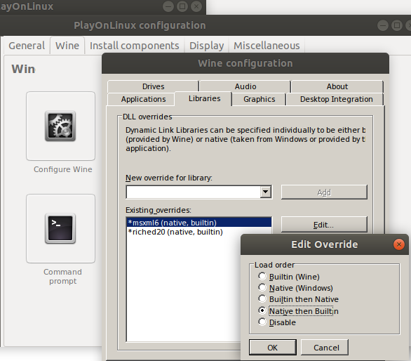
    <p>Fig. 17 .</p>
</div>

12. Na tela de configuração do Wine, clique na aba `Applications` e certifique-se de que `Windows 7` esteja selecionada como a versão do Windows. Saia para a tela de configuração do `PlayOnLinux (POL)`.

13. Selecione a guia `Wine` na tela Configuração `PlayOnLinux (POL)` e clique em `Registry Editor` para abrir o Editor do Registro.

14. Selecione para `HKEY_CURRENT_USER-> Software-> Wine`

15. Clique `Edit-> New-> Key` e nomeie esta chave `Direct2D`.

16. Selecione `Direct2D` e então `Edit-> New-> DWORD Value` e nomeie para `max_version_factory` com um valor de `0`.

<div align="center">
    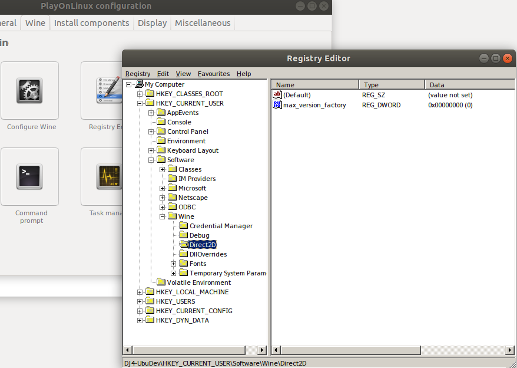
    <p>Fig. 18 .</p>
</div>

17 Feche o `Registry Editor` e retorne à tela Configuração do `PlayOnLinux (POL)`.


## 6. Configurar/Instalar o `Microsoft Office 2016` no `Linux Ubuntu` (caso ainda não esteja instalado) [1]

Para instalar o `Microsoft Office 2016` no `Linux Ubuntu`, siga os passos abaixo::

1. Abra o terminal. Você pode fazer isso pressionando: `Ctrl + Alt + T`


2. Certifique-se de que seu sistema esteja limpo e atualizado.

    2.1 Remover pacotes `.deb` antigos ou duplicados do cache local. É útil para liberar espaço, pois remove apenas os pacotes que não podem mais ser baixados (ou seja, versões antigas de pacotes que foram atualizados). Digite o seguinte comando: `sudo apt autoclean`

    2.2 Remover pacotes que foram automaticamente instalados para satisfazer as dependências de outros pacotes e que não são mais necessários. Digite o seguinte comando: `sudo apt autoremove -y`

    2.3 Buscar as atualizações disponíveis para os pacotes que estão instalados em seu sistema. Digite o seguinte comando e pressione `Enter`: `sudo apt update -y`

    2.4 Para ver a lista de pacotes a serem atualizados, digite o seguinte comando e pressione `Enter`:  `sudo apt list --upgradable`

    2.5 Realmente atualizar os pacotes instalados para as suas versões mais recentes, com base na última vez que você executou `sudo apt update -y`. Digite o seguinte comando e pressione `Enter`: `sudo apt full-upgrade -y`

    2.6 Remover pacotes que foram automaticamente instalados para satisfazer as dependências de outros pacotes e que não são mais necessários. Digite o seguinte comando: `sudo apt autoremove -y`

    2.7 Remover pacotes `.deb` antigos ou duplicados do cache local. É útil para liberar espaço, pois remove apenas os pacotes que não podem mais ser baixados (ou seja, versões antigas de pacotes que foram atualizados). Digite o seguinte comando: `sudo apt autoclean`

3. Para instalar o `7zip`, digitar o comando: `sudo apt install p7zip-full p7zip-rar -y`

4. Cria a pasta com o mesmo nome do arquivo `.iso`, se ela não existir: `mkdir -p SW_DVD5_Office_Professional_Plus_2016_W32_English_MLF_X20-41353`

5. Para extrair o arquivo `.iso`, digitar o comando: `7z x SW_DVD5_Office_Professional_Plus_2016_W32_English_MLF_X20-41353.iso -oSW_DVD5_Office_Professional_Plus_2016_W32_English_MLF_X20-41353`

6. Para instalar o `winbind`, digitar o comando: `sudo apt install winbind -y`

7. Para instalar o `playonlinux`, digitar o comando: `sudo apt install playonlinux -y`

8. Para abrir o `playonlinux`, digitar o comando: `playonlinux`


8. Clicar em `Install`:

<div align="center">
    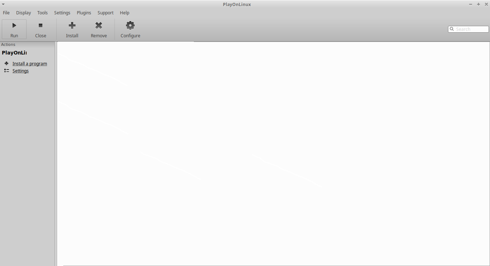
    <p>Fig. 7 .</p>
</div>


9. Clicar em `Search`:

<div align="center">
    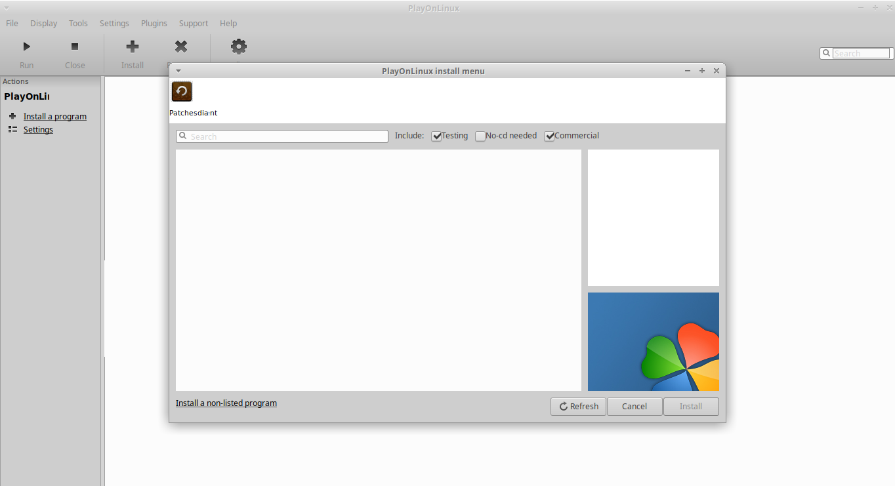
    <p>Fig. 8 .</p>
</div>


10. Digitar `Microsoft Office 2016`:

<div align="center">
    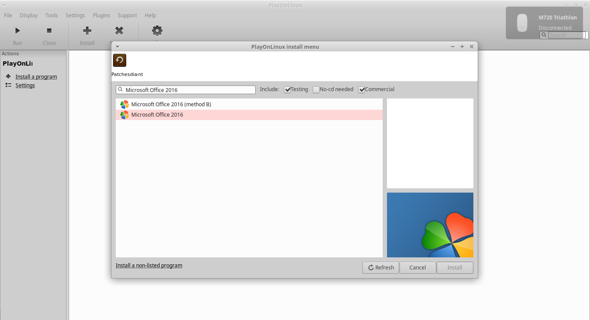
    <p>Fig. 9 .</p>
</div>


11. Clicar em `Microsoft Office 2016 (method B)`:

<div align="center">
    
    <p>Fig. 10 .</p>
</div>


12. Clicar em `Install`:

<div align="center">
    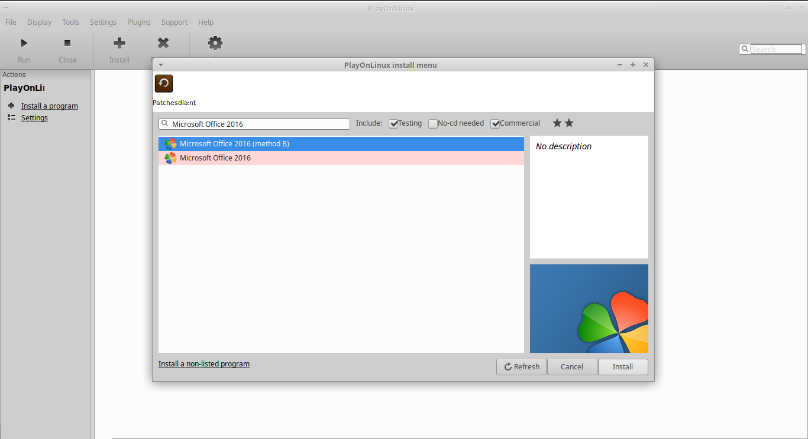
    <p>Fig. 11 .</p>
</div>


13. Seguir com as instruções do arquivo de instalação executável`.exe`

<div align="center">
    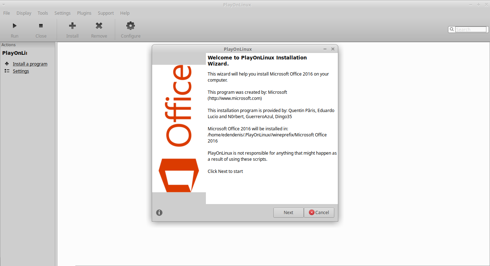
    <p>Fig. 12.</p>
</div>


Aqui estão os comandos correspondentes para cada etapa:

## 1.4 Comentários sobre os comandos

### Instalação dos pacotes `7zip`

- **`sudo apt install p7zip-full p7zip-rar -y`:** Esse comando instala os pacotes `p7zip-full` e `p7zip-rar` no sistema. Estes são utilizados para descompactar arquivos `.7z`, que é um formato de arquivo compactado com alta taxa de compressão. O `p7zip-full` fornece o suporte ao formato `7z`, e o `p7zip-rar` adiciona suporte aos arquivos `.rar`. A opção `-y` é utilizada para confirmar automaticamente qualquer pergunta feita durante a instalação.

### Descompactação de um arquivo `.iso`

- **`7z x SW_DVD5_Office_Professional_Plus_2016_W32_English_MLF_X20-41353.iso`:** Este comando utiliza o `7zip` para extrair os arquivos de dentro de uma imagem ISO, que neste caso parece ser uma versão do Microsoft Office Professional Plus 2016. O comando `7z x` é usado para extrair os arquivos com as estruturas de diretórios intactas.

### Instalação do `winbind`

- **`sudo apt install winbind -y`:** Este comando instala o pacote `winbind`, que é uma parte do conjunto de ferramentas Samba. Ele permite que o sistema operacional Linux comunique-se com serviços de diretório do Windows, como Active Directory. O `winbind` pode ser necessário para algumas aplicações do Windows rodarem adequadamente no Linux, especialmente quando são executadas através do Wine ou PlayOnLinux. Novamente, `-y` é usado para aceitar todas as prompts automaticamente.

### Instalação do PlayOnLinux

- **`sudo apt install `PlayOnLinux`-y`:** Aqui, estamos instalando o `playonlinux`, um front-end gráfico para o Wine que facilita a instalação e a execução de jogos e softwares desenvolvidos para o Windows em sistemas Linux. O `PlayOnLinux`usa scripts para fornecer uma instalação automatizada e configurada de muitos aplicativos e jogos do Windows.

### Execução do PlayOnLinux

- **`playonlinux`:** Este comando simplesmente inicia o PlayOnLinux. Depois de instalado, você pode rodá-lo sem necessidade de privilégios de superusuário.

Esses comandos são típicos para um usuário que quer instalar e usar software do Windows em um sistema operacional Linux, especificamente para a instalação de software que não foi projetado nativamente para Linux.

## 2. Código completo

### 2.1 Instalar o Wine

    ```
    sudo apt update -y
    sudo apt list --upgradable
    sudo apt full-upgrade -y
    sudo apt remove --purge wine wine64 wine32 wine-stable wine-staging -y
    sudo dpkg --add-architecture i386
    wget -nc https://dl.winehq.org/wine-builds/winehq.key
    sudo apt-key add winehq.key
    sudo add-apt-repository 'deb https://dl.winehq.org/wine-builds/ubuntu/ focal main'
    sudo apt update -y
    sudo apt install --install-recommends winehq-stable -y
    wine --version
    ```

### 2.3 Extrair o arquivo `.iso`

    ```
    sudo apt update -y
    sudo apt list --upgradable
    sudo apt full-upgrade -y
    sudo apt install p7zip-full p7zip-rar -y
    sudo mkdir SW_DVD5_Office_Professional_Plus_2016_W32_English_MLF_X20-41353
    7z x SW_DVD5_Office_Professional_Plus_2016_W32_English_MLF_X20-41353.iso -oSW_DVD5_Office_Professional_Plus_2016_W32_English_MLF_X20-41353
    ```

### 2.3 Instalar o Playonlinux

    ```
    sudo apt update -y
    sudo apt list --upgradable
    sudo apt full-upgrade -y
    sudo apt install winbind -y
    sudo apt install `PlayOnLinux`-y
    playonlinux
    ```

## Referências

[1] OPENAI. ***Instalação do bottle no ubuntu.*** Disponível em: <https://chat.openai.com/c/92444ccc-f995-4e9c-8f03-678931882241> (texto adaptado). Acessado em: 01/11/2023 19:17.

[2] OPENAI. ***Microsoft office 2016 overview.*** Disponível em: <https://chat.openai.com/c/f4373ad1-fde7-48c6-933a-91a70564cb26> (texto adaptado). Acessado em: 05/11/2023 23:22.

[3] OPENAI. ***Extrair iso com 7-zip.*** Disponível em: <https://chat.openai.com/c/9aeb16fc-d4dc-4a5b-a7eb-cd82d851d7b7> (texto adaptado). Acessado em: 06/11/2023 09:37.

[4] OPENAI. ***Converter arquivo `.iso` em `.img`.*** Disponível em: <https://chat.openai.com/c/498fa917-4067-4fc5-b69d-31c9514dc47e> (texto adaptado). Acessado em: 23/11/2023 13:47.

